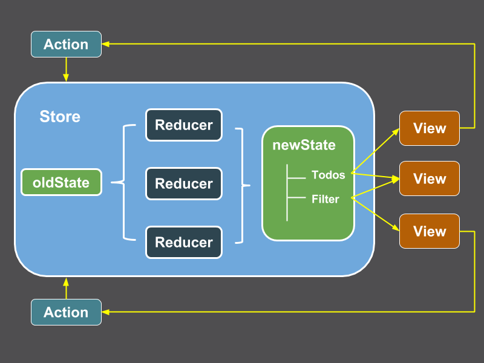

#Redux (State manage)

- manually implement the redux by lines code
- manually implement redux-thunk & redux-saga middleware
- dva

---

这次的课程会有点难理解，因为我们不是讲 redux 怎么用，而是通过自己来实现一个极简版的 redux 来理解它的使用。

所以，最后没理解也没关系。

这有两个 redux 作者亲自录制的视频，

- [Getting Started with Redux](https://egghead.io/courses/getting-started-with-redux)
- [Building React Applications with Idiomatic Redux](https://egghead.io/courses/building-react-applications-with-idiomatic-redux)

如果没有理解，再看看这两个视频会很有帮助，实际我下面的内容基本也是从这两个视频学来的。

React 的难点在于 state 的管理，即各组件间如何共享数据，如何通信。

一个例子，在前面我们实现了 Counter 的 component，它在内部有一个自己的 state。如果页面上有两个 Counter component，它们之间是没有关系的，它们内部的 state 是相互隔离和独立的。

    type Props = {
      initialCnt: number
    }

    type State = {
      cnt: number
    }

    export default class Counter extends React.Component<Props, State> {
      constructor(props: Props) {
        super(props)

        this.state = {
          cnt: props.initialCnt
        }
      }

      incCount = () => {
        this.setState({cnt: this.state.cnt + 1})
      }

      decCount = () => {
        this.setState({cnt: this.state.cnt - 1})
      }

      render() {
        const { cnt } = this.state

        return (
          

            <button onClick={this.decCount}>-</button>
            {cnt}
            <button onClick={this.incCount}>+</button>
          

        )
      }
    }

    // -------

    export default class CounterContainer extends React.Component {
      render() {
        return (
          

            <Counter initialCnt={5}/>
            <Counter initialCnt={6}/>
          

        )
      }
    }

那么，如果我想实现这样的效果，点击任意一个 Counter component 的 + 或 - 按钮，都会影响另一个 Counter component，使它们始终显示相同的 cnt 值。这意味着，它们需要共享相同的 state。

一个更真实的例子是这样的，一个购物页面，一个 component 显示商品列表，一个 component 显示购物车，在商品列表选择某件商品后，这个商品应该同步显示在购物车中，在任意一个 component 改变所购商品的件数后，另一个 component 中都应该显示相同的所购件数。

怎么实现呢，如果这两个 component 离得很近，比如属于同一个父组件，有一个简单的办法叫 State Lift Up。将内部的 state 提升到父组件中管理，子组件变成展示型组件，父组件变成容器型组件。

Counter2:

    type Props = {
      cnt: number
      onInc: () => void
      onDec: () => void
    }

    export default class Counter2 extends React.Component<Props> {
      incCount = () => {
        this.props.onInc()
      }

      decCount = () => {
        this.props.onDec()
      }

      render() {
        return (
          

            <button onClick={this.decCount}>-</button>
            {this.props.cnt}
            <button onClick={this.incCount}>+</button>
          

        )
      }
    }

CounterContainer2:

    type Props = {
      initialCnt: number
    }

    type State = {
      cnt: number
    }

    export default class CounterContainer2 extends React.Component<Props, State> {
      constructor(props: Props) {
        super(props)
        this.state = {
          cnt: props.initialCnt
        }
      }

      incCount = () => {
        this.setState({cnt: this.state.cnt + 1})
      }

      decCount = () => {
        this.setState({cnt: this.state.cnt - 1})
      }

      render() {
        const { cnt } = this.state
        return (
          

            <Counter2 cnt={cnt} onInc={this.incCount} onDec={this.decCount}/>
            <Counter2 cnt={cnt} onInc={this.incCount} onDec={this.decCount}/>
          

        )
      }
    }

局限：两个组件必须离得很近。假设另一个组件嵌套得很深，就必须一层一层地传递，很麻烦。

有没有更简单粗暴的方法呢 -- 全局变量！(后面我们会让它变得优雅起来) 这个全局变量用来存储所有 state，我们称之为 store。

创建一个 store.ts

为什么要用函数，生成闭包，使之不能直接修改，只能通过方法修改，因为通过方法可以生成多个 store

    function createStore(initialState: any) {
      const state = initialState || {}

      function getState() {
        return state
      }

      return {
        getState,
      }
    }

    const store = createStore({ cnt: 6 })

    export default store

那要怎么修改 state 呢，你会想也许我们可以直接在这里面加上 incCnt / decCnt 之类的方法：

    function incCnt() {
      state = {
        ...state,
        cnt: state.cnt + 1
      }
    }

    function decCnt() {
      state = {
        ...state,
        cnt: state.cnt - 1
      }
    }

    return {
      getState,
      incCnt,
      decCnt
    }

同时，修改 state 后我们要触发 UI 的重新渲染。这个怎么做到了，使用订阅/通知模式。(之后可以看看如果没有这个会怎么样)

这部分开始稍微有点烧脑了，要好好理解。

    let listeners: (()=>void)[] = []

    function subscribe(listener: () => void) {
      listeners.push(listener)
      return () => listeners.filter(item => item != listener)  // 很精妙!
    }

    function notifyListeners() {
      listeners.forEach(item => item())
    }

    function incCnt() {
      ...
      notifyListeners()
    }

    function decCnt() {
      ...
      notifyListeners()
    }

    return {
      getState,
      incCnt,
      decCnt,
      subscribe
    }

Counter4:

  import store from './store'

  export default class Counter4 extends React.Component {
    subscription: any

    componentDidMount() {
      this.subscription = store.subscribe(()=>this.forceUpdate())
    }

    componentWillUnmount() {
      this.subscription()
    }

    incCount = () => {
      store.incCnt()
    }

    decCount = () => {
      store.decCnt()
    }

    render() {
      const { cnt } = store.getState()

      return (
        

          <button onClick={this.decCount}>-</button>
          {cnt}
          <button onClick={this.incCount}>+</button>
        

      )
    }
  }

试想，如果每种对 state 的修改我们都要往 store 中增加方法的话，是不是很不方便，而且违反了设计模式中的开放关闭原则。开放关闭原则说的是，如果想新增功能，应该是通过扩展实现，而不是修改原来的代码。

redux 将对 state 的修改抽象为一个统一的方法：`dispatch(action)`，外界往 store 中 dispatch 一个 action，这个 action 包含 type 和 payload 两部分。store 接收到 action 后，统一交给 reducer 来处理。reducer 只是一些纯函数罢了，其实就是上面的 incCount, decCount 这些方法，它会生成新的 state。

为了使 store 符合开闭原则，我们把 reducer 定义在 store 外面，然后通过 `createStore()` 的参数传到 store 里。

实现 reducer：

    export default function cnt(state: any, action: Action) {
      switch(action.type) {
        case 'INC_CNT':
          return {
            ...state,
            cnt: state.cnt + 1
          }
        case 'DEC_CNT':
          return {
            ...state,
            cnt: state.cnt - 1
          }
        case 'RESET_CNT':
          return {
            ...state,
            cnt: action.payload
          }
        defalut:
          return state  // !!! 别漏了 default
      }
    }

实现 dispatch 方法：

    import cnt from "./reducers/cnt";

    function createStore(initialState: any, reducer: Reducer) {
      let state = initialState || {}
      let listeners: (()=>void)[] = []

      function dispatch(action: Action) {
        state = reducer(state, action)
        notifyListeners()
      }

      return {
        getState,
        incCnt,
        decCnt,
        subscribe,
        dispatch
      }
    }

    const store = createStore({ cnt: 6 }, cnt)

使用：

    export default class Counter5 extends React.Component {
      subscription: any

      componentDidMount() {
        this.subscription = store.subscribe(()=>this.forceUpdate())
      }

      componentWillUnmount() {
        this.subscription()
      }

      incCount = () => {
        store.dispatch({
          type: 'INC_CNT'
        })
      }

      decCount = () => {
        store.dispatch({
          type: 'DEC_CNT'
        })
      }

      resetCount = () => {
        store.dispatch({
          type: 'RESET_CNT',
          payload: 100
        })
      }

      render() {
        const { cnt } = store.getState()

        return (
          

            <button onClick={this.decCount}>-</button>
            {cnt}
            <button onClick={this.incCount}>+</button>
            <button onClick={this.resetCount}> RESET </button>
          

        )
      }
    }

我们继续来优化。Counter5 包含两部分逻辑，一部分是计数器自身的逻辑，包括展示计数值，加的动作，减的动作。一部分是与 store 的交互逻辑，包括从 store 中拿到 state，往 store dispatch action。我们可以把这两部分拆开，前者拆成纯粹的展示型组件，跟 store 没有任何关系，很独立，使之可以方便复用。后者拆成容器型组件，它负责从 store 中拿到 state 并传递给展示型组件，并且从展示型组件那里接受回调后 dispatch action 给 store。

我们把它拆成 Counter6 和 CounterContainer6 两个组件。

Counter6:

    type Props = {
      cnt: number
      onInc: () => void
      onDec: () => void
      onReset: () => void
    }

    export default class Counter6 extends React.Component<Props> {
      incCount = () => {
        this.props.onInc()
      }

      decCount = () => {
        this.props.onDec()
      }

      resetCount = () => {
        this.props.onReset()
      }

      render() {
        return (
          

            <button onClick={this.decCount}>-</button>
            {this.props.cnt}
            <button onClick={this.incCount}>+</button>
            <button onClick={this.resetCount}> RESET </button>
          

        )
      }
    }

CounterContainer6:

    import store from './redux/store'
    import Counter6 from './Counter6'

    export default class CounterContainer6 extends React.Component {
      subscription: any

      componentDidMount() {
        this.subscription = store.subscribe(()=>this.forceUpdate())
      }

      componentWillUnmount() {
        this.subscription()
      }

      incCount = () => {
        store.dispatch({
          type: 'INC_CNT'
        })
      }

      decCount = () => {
        store.dispatch({
          type: 'DEC_CNT'
        })
      }

      resetCount = () => {
        store.dispatch({
          type: 'RESET_CNT',
          payload: 100
        })
      }

      render() {
        const { cnt } = store.getState()
        return <Counter6 cnt={cnt}
                         onInc={this.incCount}
                         onDec={this.decCount}
                         onReset={this.resetCount}/>
      }
    }

使用 CounterContainer6，发现它的效果和 Counter5 是一样的。

我们发现容器型组件的逻辑都是类似的，从 store 取 state，往 store dispatch action，如要我们要为每一个展示型组件都写一个容器型组件，是不是很烦。可不可以抽象出来，简化写法，自动生成这个容器型组件。

这就是你们在很多地方能看到的 connect() 方法。比如上面这个容器型组件用 connect() 方法是这样生成的。

    const mapStatetoProps = (state: any) => {
      return {
        cnt: state.cnt
      }
    }

    const mapDispatchToProp = (dispatch) => {
      return {
        onInc: () => dispatch({type: 'INC_CNT'}),
        onDec: () => dispatch({type: 'DEC_CNT'}),
        onReset: () => dispatch({type: 'RESET_CNT', payload: 100})
      }
    }

    connect(mapStateToProps, mapDispatchToProps)(Counter6)

接下来我们就来实现这个 connect 方法。

首先，它的参数是两个函数，它的返回值也是一个函数 (高阶函数)，这个函数的参数是一个展示型组件，返回值是一个容器型组件，有点烧脑了 (所谓的高阶组件，也就是装饰器模式)。

    function connect(mapStatetoProps, mapDispatchToProsp) {
      return function(Component) {
        return ...
      }
    }

最终实现：

    import React from 'react'
    import store from './store'

    export default function connect(mapStateToProps: (state: any) => any, mapDispatchToProps: (dispatch: any) => any) {
      return function(MyComponent: any) {
        class Container extends React.Component {
          subscription: any
        
          componentDidMount() {
            this.subscription = store.subscribe(()=>this.forceUpdate())
          }
        
          componentWillUnmount() {
            this.subscription()
          }

          render() {
            const myState = mapStateToProps(store.getState())
            const myActions = mapDispatchToProps(store.dispatch)
            return <MyComponent {...myState} {...myActions} {...this.props}/>
          }
        }
        return Container
      }
    }

我们来使用这个自己实现的 connect 方法，看看能不能达到相同的效果。

示例：Counter7

    import React from 'react'
    import connect from './redux/connect'

    type Props = {
      cnt: number
      onInc: () => void
      onDec: () => void
      onReset: () => void
    }

    class Counter7 extends React.Component<Props> {
      incCount = () => {
        this.props.onInc()
      }

      decCount = () => {
        this.props.onDec()
      }

      resetCount = () => {
        this.props.onReset()
      }

      render() {
        return (
          

            <button onClick={this.decCount}>-</button>
            {this.props.cnt}
            <button onClick={this.incCount}>+</button>
            <button onClick={this.resetCount}> RESET </button>
            (Counter 7)
          

        )
      }
    }

    /////////

    const mapStatetoProps = (state: any) => {
      return {
        cnt: state.cnt
      }
    }

    const mapDispatchToProp = (dispatch: any) => {
      return {
        onInc: () => dispatch({type: 'INC_CNT'}),
        onDec: () => dispatch({type: 'DEC_CNT'}),
        onReset: () => dispatch({type: 'RESET_CNT', payload: 100})
      }
    }

    export default connect(mapStatetoProps, mapDispatchToProp)(Counter7)

---

还有一个问题，我们回过头来看 connect 的实现，因为 connect 实际应该是放在一个第三方库里的，而我们的应用将依赖这个第三方库，第三方库不能依赖我们的应用。而 store 这个全局对象是由我们自己的应用创建出来的，connect 不能依赖它。

正确的方法是，第三方库应该提供一个方法，这个方法接受 store 作为参数。

新版本的 React 自己提供了一个叫 `createContext()` 的方法，它可以用来创建一个类似全局变量的对象。

具体的用法是这样的，首先，创建一个 StoreContenxt 的对象：

    import React from "react"

    export const StoreContext = React.createContext({})

StoreContext 实际有两个成员，一个是 StoreContext.Provider，一个是 StoreContext.Comsumer，从名字就可以看出，一个是生产者，一个是消费者。我们将 store 传递给 StoreContext.Provider，然后在 StoreContext.Comsumer 中得到它。

使用，在最顶层：

    const store = createStore({ cnt: 1000 }, cnt)

    class App extends Component {
      render() {
        return (
          <StoreContext.Provider value={store}>
            <Counter8/>
            <Counter8/>
          </StoreContext.Provider>
        );
      }
    }

实现新的 connect 方法，store 不再从全局变量 import，而是从 StoreContext.Comsumer 中得到。

    import { StoreContext } from './StoreContext'

    export default function connect2(mapStateToProps: (state: any) => any, mapDispatchToProps: (dispatch: any) => any) {
      return function(MyComponent: any) {
        class Container extends React.Component {
          subscription: any
          store: any
        
          componentDidMount() {
            this.subscription = this.store.subscribe(()=>this.forceUpdate())
          }

          componentWillUnmount() {
            this.subscription()
          }

          wrapComponnet(store: any) {
            this.store = store
            const myState = mapStateToProps(store.getState())
            const myActions = mapDispatchToProps(store.dispatch)
            return <MyComponent {...myState} {...myActions}/>
          }

          render() {
            return (
              <StoreContext.Consumer>
                {(store) => this.wrapComponnet(store)}
              </StoreContext.Consumer>
            )
          }
        }
        return Container
      }
    }

----

到目前为止，我们知道，redux 的 reducer 只能处理同步 action，它是纯函数。但现实世界并不这么简单。

比如如何处理网络请求，称之为副作用。

redux 为了保证自己的纯洁性，把处理副作用的脏活累活操作交给别人，我们称之为 middleware，常见的有 redux-thunk, redux-saga。

为了使 middleware 在 reducer 之前执行，我们使用一种叫 hook 的方法，劫持 store.dispatch 方法，在原来的 dispatch 方法执行之前先执行一部分代码。ruby 程序员对此不会陌生，每天都在用，比如 `before_action`，`before_save`。

先来看 redux-thunk 是怎么实现的，redux-thunk 允许你 dispatch 一个方法来执行副作用。

    export default function addReduxThunkMiddleware(store: any) {
      const oldDispatch = store.dispatch
      store.dispatch = function(action: any) {
        if (typeof action === 'function') {
          action(oldDipsatch) // 精妙!
        } else {
          oldDispatch(action)
        }
      }
    }

在加上这个 middleware 之前，我们先来看一下不加这个 middleware 我们能否 dispatch 一个方法。

copy Counter8 成 Counter9，增加一个按钮，"Delay Inc"，点击后触发 onDeplayInc 回调，如下所示：

    function delayIncCount(dispatch: any) {
      setTimeout(() => {
        dispatch({type: 'INC_CNT'})
      }, 1000)
    }

    const mapDispatchToProp = (dispatch: any) => {
      return {
        onInc: () => dispatch({type: 'INC_CNT'}),
        onDec: () => dispatch({type: 'DEC_CNT'}),
        onReset: () => dispatch({type: 'RESET_CNT', payload: 1000}),
        onDelayInc: () => dispatch(delayIncCount)
      }
    }

运行后虽然没有报错，但得不到预期结果。

然后我们调用 addReduxThunkMiddleware(store) 方法，加上 redux-thunk middleware 再看效果。

在 App.tsx 中：

    const store = createStore({ cnt: 1000 }, cnt)
    addReduxThunkMiddleware(store)

执行后得到预期结果，cnt 值会在一秒后加 1。

redux-thunk 就是这么个东西，真正的逻辑就那几行代码。

---

接下来我们来看看 redux-saga middleware 是怎么工作的。它和 redux-thunk 的思想不一样，倒是和 reducer 的思想差不多。dispatch 的 action 将永远是 plain object。

redux-saga 监听某些 type 的 action，匹配到相应的 action 后，再执行一个副作用的函数。

比如：

    function delayIncCount(dispatch: any) {
      setTimeout(() => {
        dispatch({type: 'INC_CNT'})
      }, 1000)
    }

    function saga(action, oldDispatch) {
      switch(action.type) {
        case 'DELAY_INC_CNT':
          delayIncCount(oldDispatch)
          break
      }
    }

增加对 redux-saga middleware 的支持：

    export default function addReduxSagaMiddleware(store: any, sagas: any) {
      const oldDispatch = store.dispatch

      store.dispatch = function(action: any) {
        sagas(action, oldDispatch)

        oldDispatch(action)
      }
    }

使用，在 App.tsx 中：

    addReduxSagaMiddleware(store, saga)

在 Counter 9 中增加一个按钮："Delay Inc (saga)"，点击后 dispatch 出一个 "DELAY_INC_CNT" 的 action。

    <button onClick={() => this.props.onDelayIncBySaga() }> Delay Inc (saga) </button>

    const mapDispatchToProp = (dispatch: any) => {
      return {
        ...
        onDelayIncBySaga: () => dispatch({type: 'DELAY_INC_CNT'})
      }
    }

---

最后，简单介绍一下 dva，它其实是 redux-saga 的一层封装，有几个好处：

1. 把副作用操作和 reducer 写在一个文件里，逻辑不会分散到各个文件中
1. 不用再定义各种 type，type 就是函数名。

看 vox.music 的例子。

---

作业：
